Instal·lació i configuració SSH a Ubuntu

Activació del servei SSH a Windows i connexió des d'Ubuntu.

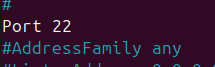
Generació de clau SSH i accés sense contrasenya.

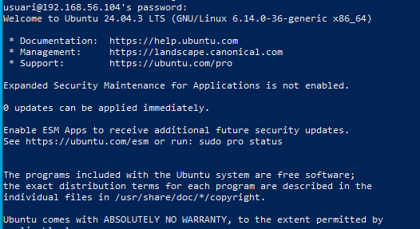
Creació d'usuaris i proves d'accés SSH.

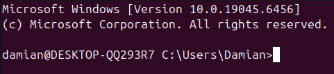
Configuració de seguretat al fitxer sshd_config.

Verificació del servei SSH i accés des de Windows.

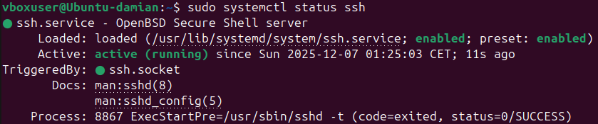
Instal·lació d'OpenSSH i resolució d'errors inicials.

Gestió d'usuaris i accés
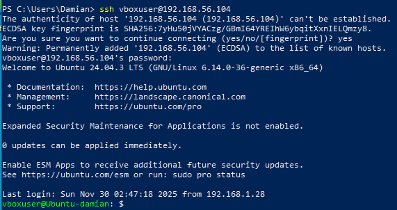
Creació de nous usuaris amb contrasenya.

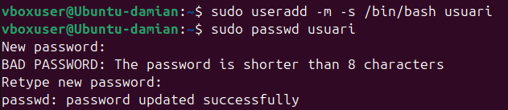
Accés denegat per root via SSH.

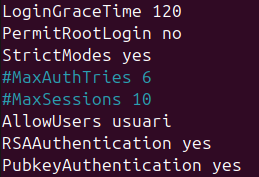
Accés correcte amb usuari normal.

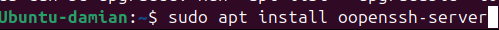
Usuari2 no pot accedir via SSH.

Clau pública i accés remot
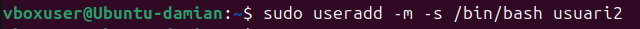
Generació de clau pública amb ssh-keygen.

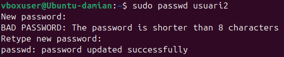
Còpia de la clau pública al servidor.

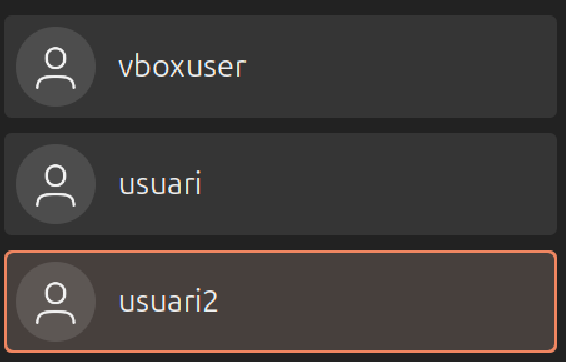
Accés sense contrasenya amb clau pública.

Configuració Windows per SSH

Instal·lació de la funcionalitat OpenSSH Server.

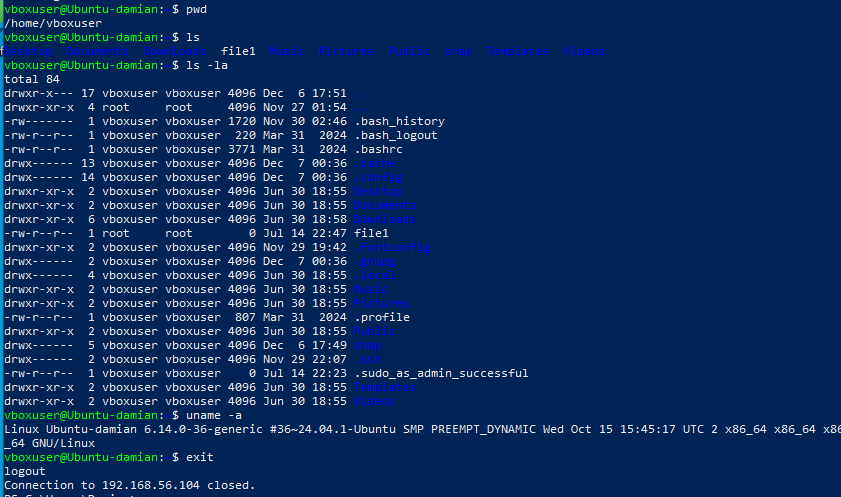
Activació del servei SSH a Windows.

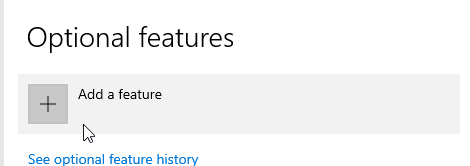
Verificació del servei sshd en execució.

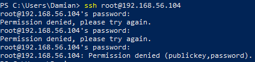
Connexió des d'Ubuntu cap a Windows.

Navegació i informació del sistema

Comprovació de fitxers i directori personal.

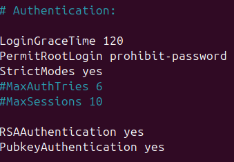
Llistat detallat amb permisos i propietaris.

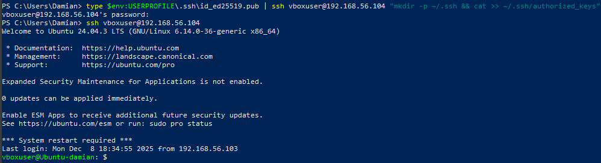
Informació del sistema amb uname.

Configuració avançada SSH
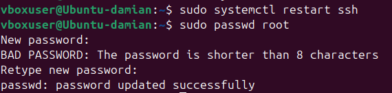
Paràmetres avançats de seguretat SSH.

Assignació de contrasenya a root.

Creació d'usuaris amb bash i home.

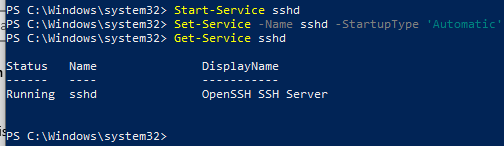
Verificació visual dels usuaris creats.

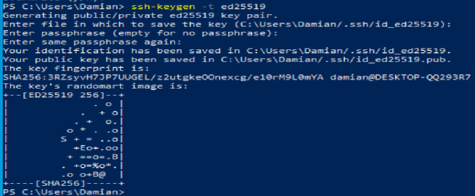
Connexió fallida amb usuari2.

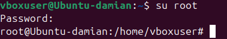
Connexió correcta amb usuari via SSH.

Ask

